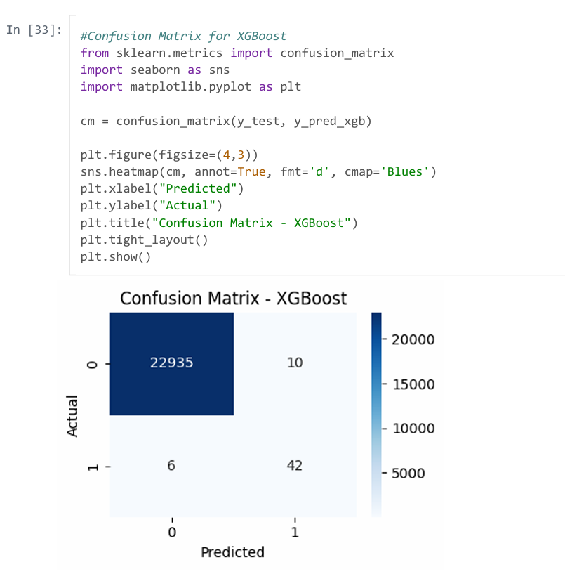
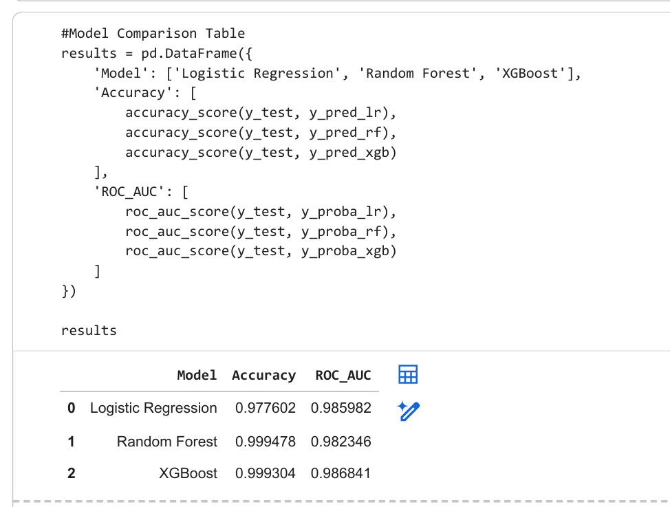
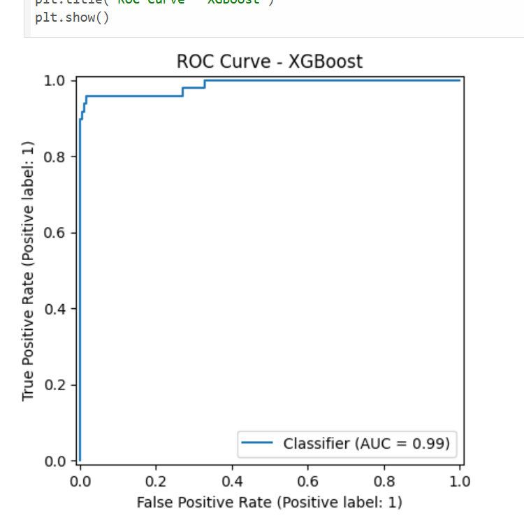

### 💳 Credit Card Fraud Detection — Machine Learning Project

This project focuses on detecting fraudulent credit card transactions using machine learning.
Fraud cases are extremely rare, making the dataset highly imbalanced — a realistic challenge in financial fraud detection.

The goal was to build a model that can accurately identify fraud while minimizing false negatives.

### 🧠 What I Did in This Project

1️⃣ Data Loading & Initial Exploration
Loaded the dataset using pandas

Explored dataset shape, column types, and summary statistics

Verified that there were no NaN values

Checked the distribution of the target variable (Class)

Identified a severe class imbalance (fraud cases < 1%)

2️⃣ Data Cleaning
Even though the dataset had no missing values, I still:

Checked for duplicates

Verified data consistency

Ensured all features were numerical and ready for modeling

3️⃣ Feature Scaling
Applied StandardScaler to normalize features

Scaling improved model performance, especially for Logistic Regression and XGBoost

4️⃣ Handling Class Imbalance
The biggest challenge in fraud detection is imbalance.
To solve this:

Used SMOTE (Synthetic Minority Oversampling Technique)

Balanced the dataset so the model could learn fraud patterns

This significantly improved recall and F1‑score

5️⃣ Model Training
Trained and compared three models:

Logistic Regression

Random Forest

XGBoost

Evaluated using:

Precision

Recall

F1‑Score

AUC‑ROC

6️⃣ Model Evaluation
Plotted Confusion Matrix

Plotted ROC Curve

Compared all models

Selected XGBoost as the best model

### 🏆 Final Results

Best Model: XGBoost

Precision: 0.81

Recall: 0.88

F1‑Score: 0.84

AUC‑ROC: 0.9868408149923731

### 🖼️ Screenshots

### 🔢Confusion Matrix (XGBoost)

### 📊Compared Models(Model Performance Comparison)

### 📈ROC Curve (XGBoost)

